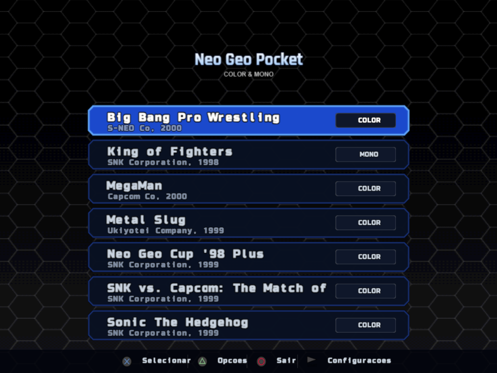
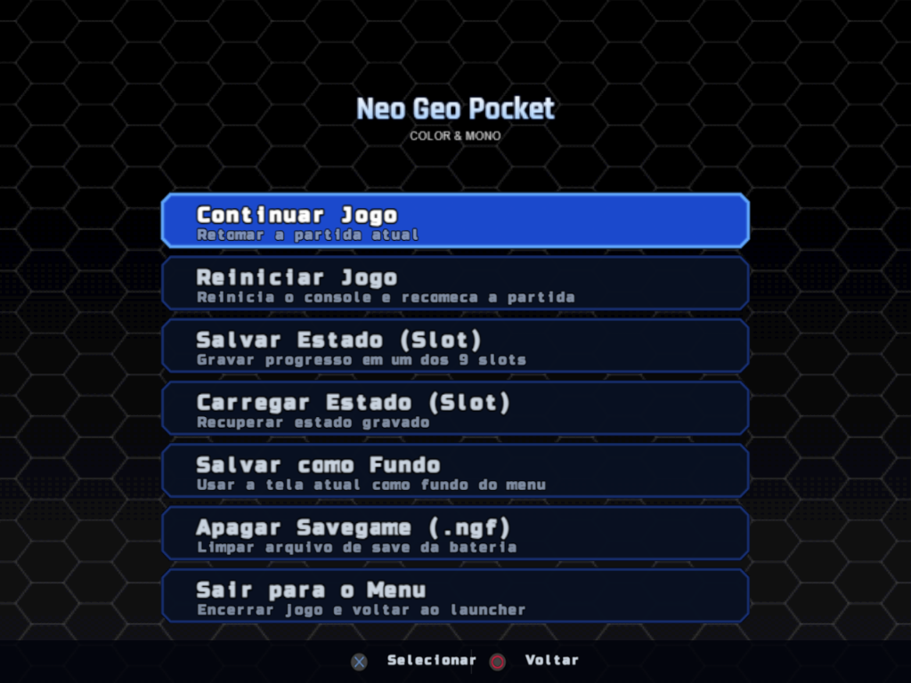

# NGPPS2 - Neo Geo Pocket / Color Emulator for PlayStation 2

**NGPPS2** é um emulador e frontend integrado de Neo Geo Pocket e Neo Geo Pocket Color desenvolvido especificamente para o PlayStation 2. O projeto conta com um core profundamente otimizado para o hardware do console, além de uma interface gráfica (Launcher) moderna, intuitiva e repleta de recursos visuais e de personalização.

## Capturas de Tela

<div align="center">
  
  
</div>
<div align="center">
  
  
</div>

## Recursos:

## Launcher & Interface
- **Suporte a Múltiplos Idiomas:** Interface traduzida nativamente para Português, Inglês e Espanhol.
- **Teclado Virtual Integrado:** Edite Título, Subtítulo e Tags dos jogos diretamente na TV via controle.
- **Visual Customizável:**
  - Ativação/desativação de subtítulos, tags (COLOR / MONO), badges e barra de rolagem.
  - Janela de confirmação para ações críticas (como apagar dados).
- **Backgrounds Dinâmicos:** Suporte a planos de fundo individuais por jogo (`background.tm2`).
- **Navegação Ágil:** Leitura rápida de diretórios e inicialização direta.

### In-Game & Emulação
- **Menu de Ação Suspenso (`START` + `SELECT`):** Acesso a ferramentas rápidas sem precisar reiniciar o PS2.
- **Save States Avançados:** 
  - Múltiplos slots disponíveis (até 9 slots).
  - Salve, recarregue ou apague states facilmente.
- **Captura de Tela como Fundo:** Opção in-game de salvar o frame atual da gameplay como plano de fundo (`background.tm2`) para a interface daquele jogo.
- **Gerenciamento de Saves de Bateria:** Exclusão segura de save games internos (`.ngf`) do cartucho caso precise resetar a memória original do jogo.
- **IGR (In-Game Reset) e Retorno:** Configuração de caminho de saída personalizável (ex.: `mass:/APPS/BOOT/OPL/BOOT.ELF` ou retorno ao Launcher).

---

## Estrutura de Pastas (Instalação no Pendrive)

Para o funcionamento correto no PlayStation 2 via USB, o pendrive deve conter a seguinte estrutura na raiz (**atenção para letras maiúsculas no nome da pasta principal**):

```text
raiz_do_pendrive/
└── NGPPS2/
    ├── NGPPS2.ELF
    ├── assets/
    │   ├── ... (arquivos de interface, fontes, atlas)
    │   └── translate/
    │       ├── en_us.lang
    │       ├── es_es.lang
    │       └── pt_br.lang
    └── games/
        ├── Jogo1/
        │   ├── rom.ngc (ou .ngp)
        │   ├── config_game.cfg (opcional)
        │   └── background.tm2 (opcional)
        └── Jogo2/
            └── game.ngc

Nota: O executável .ELF pode ser iniciado a partir de qualquer local, mas recomenda-se mantê-lo dentro da pasta NGPPS2/.
```

## Configuração dos Jogos (config_game.cfg)
O arquivo config_game.cfg é totalmente opcional. Se ele não existir, o emulador utilizará o nome da pasta como título base. Caso queira personalizar manualmente (ou pelo teclado virtual do launcher), o arquivo segue o formato:

```text
[game]
title = Sonic The Hedgehog
subtitle = SNK Corporation, 1999
tag = COLOR
show_subtitle = 1
show_tag = 1
enabled = 1
```

- **Formatos suportados:**
  - `.ngc` - Neo Geo Pocket Color
  - `.ngp` - Neo Geo Pocket Monochrome

---

## Controles

### No Menu / Launcher

| Botão | Ação |
| :--- | :--- |
| **D-Pad** | Navegação pelas opções |
| **✕ (Cross)** | Confirmar / Selecionar / Entrar |
| **△ (Triangle)** | Opções do jogo (Editor de Título, Subtítulo, Tag, Deletar Fundo) |
| **◯ (Circle)** | Voltar / Sair |
| **START** | Acessar Configurações Gerais do Sistema |

### In-Game (Em partida)

| Botão | Ação |
| :--- | :--- |
| **START + SELECT** | Abre o Menu de Ação In-Game |
| *(Dentro do Menu)* | Salvar/Carregar States, Salvar Frame como Fundo, Deletar Save `.ngf`, Sair para o Menu |

---

## Ambientes Testados

- **PlayStation 2 (Hardware Real):** Carregamento via USB formatado em **exFAT**.
- **Rede / Dev:** Testado via **PS2Link / ps2client**.
- **Emulador de PC:** Testado no **PCSX2** (versões recentes).

---

## Créditos e Agradecimentos

Este projeto reúne código e estudos de diversos projetos históricos da comunidade de emulação:

- **[NeoPop](https://github.com/8bitpsp/neopop/)** – Emulador base utilizado como ponto de partida para a implementação.
- **[MAME](https://github.com/alekmaul/mame4allds2)** – Emulação do núcleo e CPU de áudio (Sound Core).
- **[RACE](https://github.com/alekmaul/race)** – Utilizado como base de estudo e referência para a correção e implementação do salvamento em memória não-volátil/bateria (`.ngf`).
- **[PS2SDK](https://github.com/ps2dev/ps2sdk)** – SDK livre da comunidade para desenvolvimento de software no PlayStation 2.
- **[gsKit](https://github.com/ps2dev/gsKit)** – Biblioteca gráfica utilizada para o gerenciamento de texturas, renderização de atlas e interface do Launcher.
